### Submitted by: Monica Zulueta-Linsngan
### Date: August 3, 2019

# Visualization:

In this project, I have created visualization using Tableau. The dataset was provided to us students, and this were pulled from the Citi Bike data webpage.

# Source:
* https://www.citibikenyc.com/system-data)

# Tableau Output web link below:
* https://public.tableau.com/profile/monica.zulueta.linsangan#!/vizhome/NY_Citi_Bike_15647172610540/Overview?publish=yes

# The dataset of Citi Bike Trip History Logs were utilized to build a data dashboard and reports shown on the following images:

### Dataset

### Overview

### Single Bike
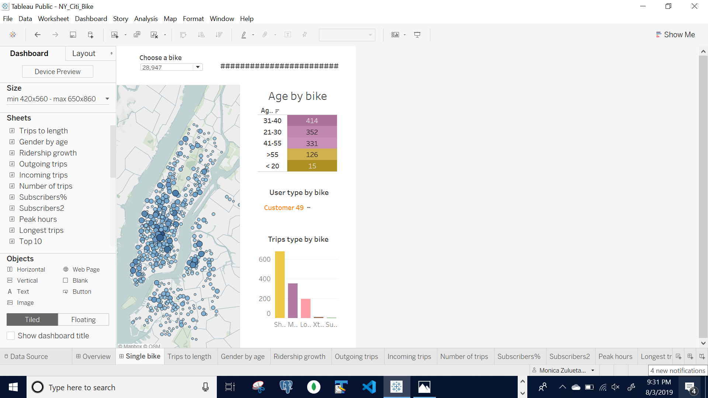

### Trips Length
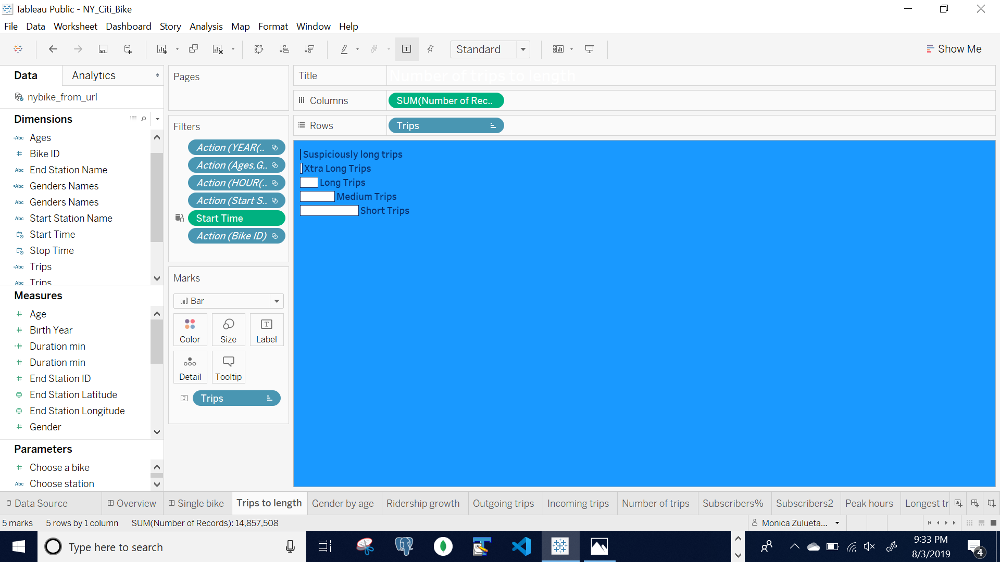

### Gender by Age
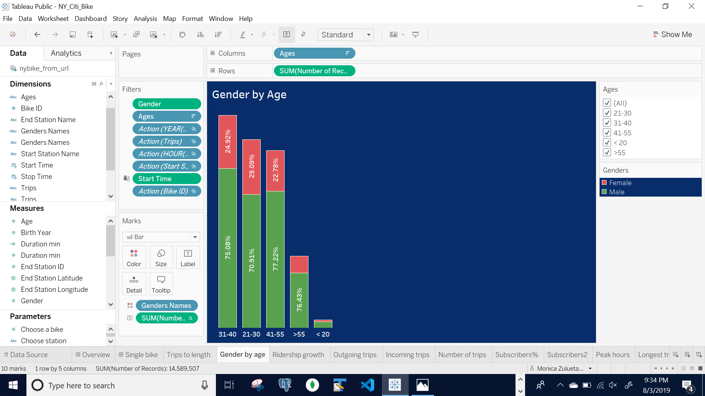

### Ridership Growth
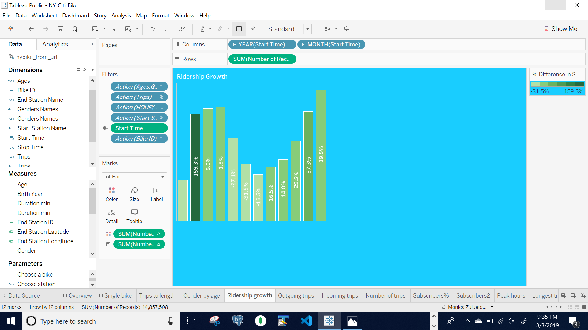

### Outgoing Trips
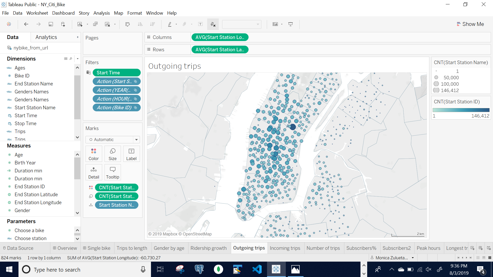

### Incoming Trips
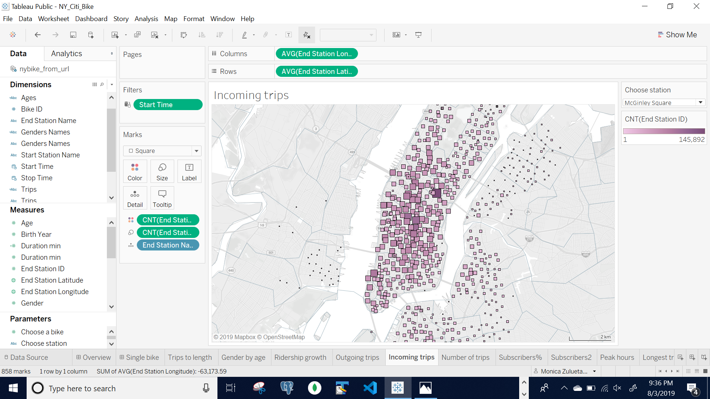

### Number Of Trips

### Incoming Trips

### Subscribers Percentage

### Subscribers & Customers

### Peak Hours

### Longest Trips

### Top 10 Stations of Bike Rides

### Top & Bottom Start
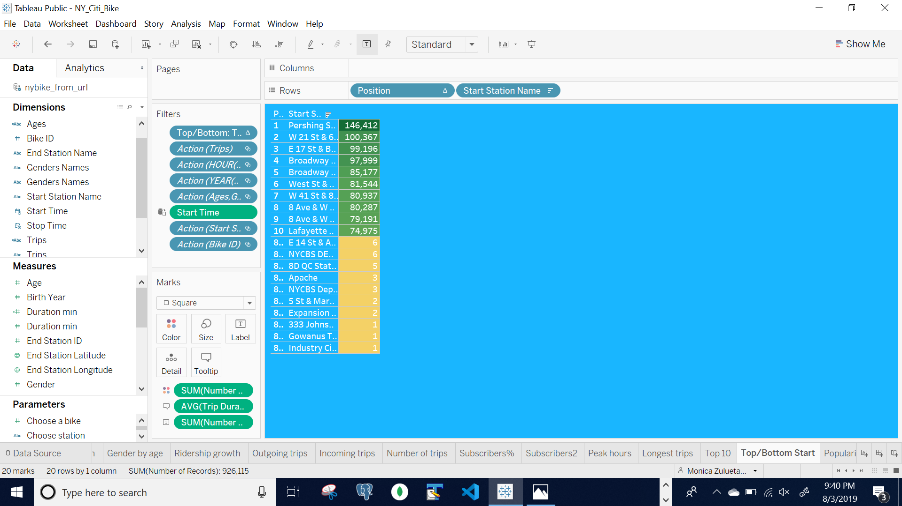

### Top & Bottom End
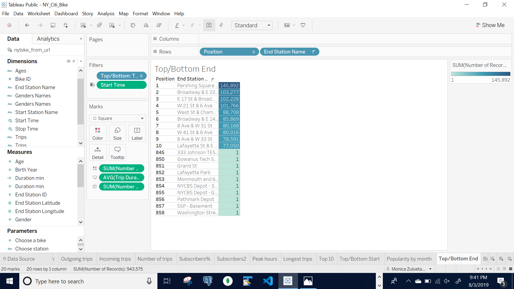

### Popularity by Month
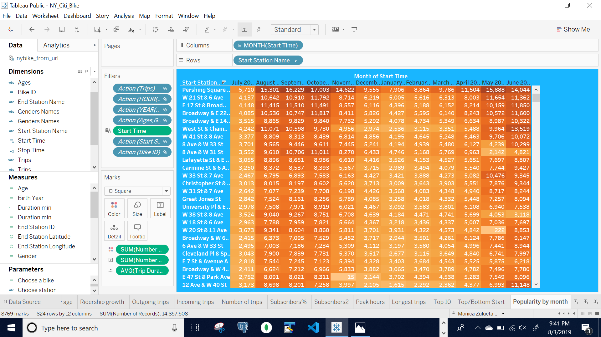

### Bike Usage
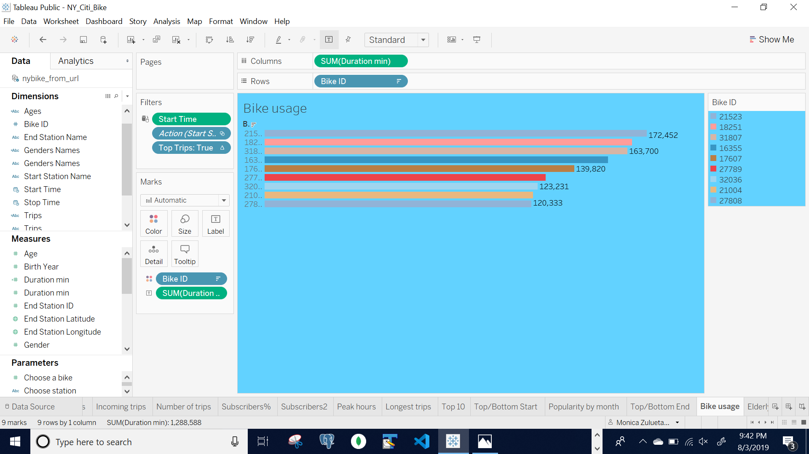

### Elderly Rides
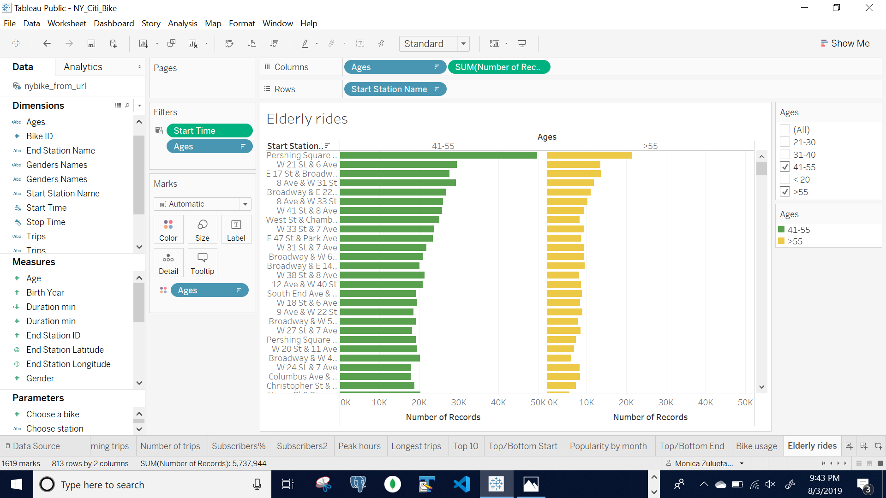

### Bikes Rotation
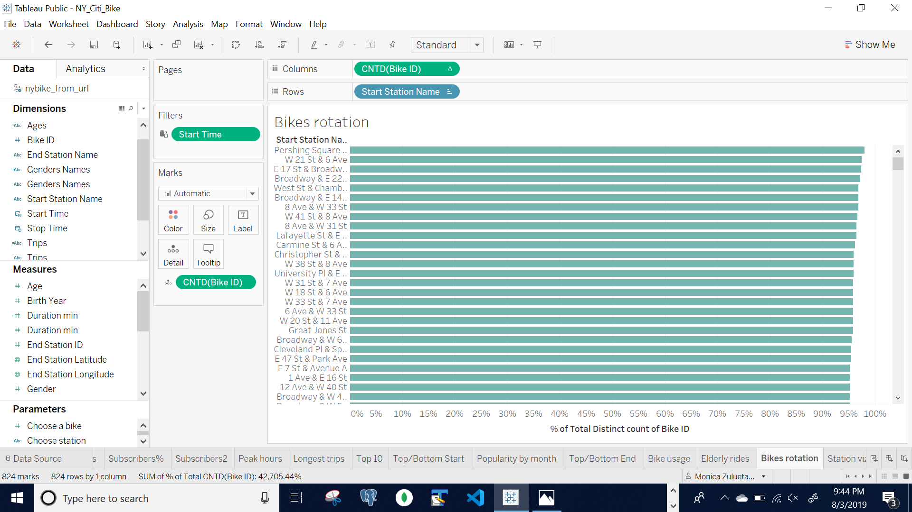

### Rides of Bike

### Station Visits

### Age of Bike Riders
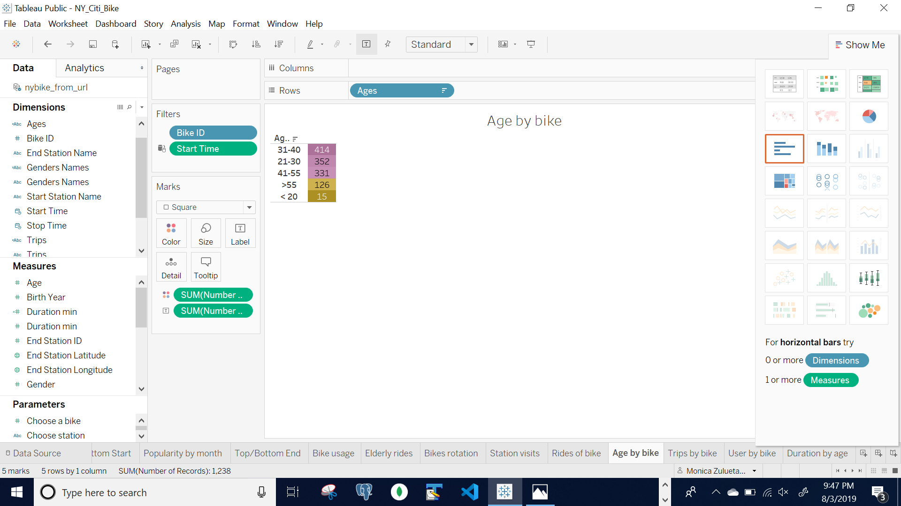

### Trips by Bike
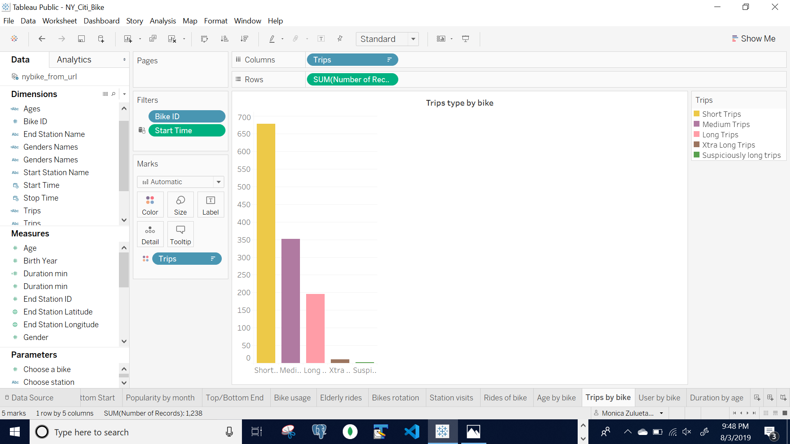

